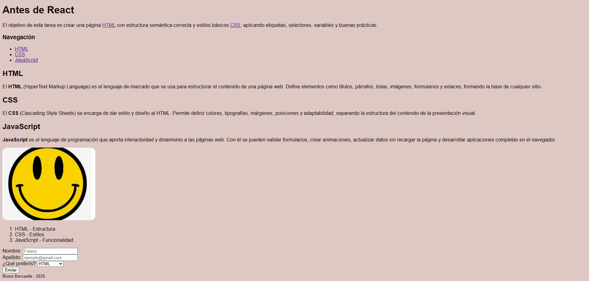

# Mi Primera Página Web Semántica y Estilizada

## Descripción
Este proyecto consiste en una página web creada con **HTML** y **CSS**, aplicando estructura semántica, etiquetas, clases, selectores, variables CSS y buenas prácticas de codificación. La página incluye un menú de navegación, un artículo con subtítulos y párrafos, una imagen, una lista ordenada y un formulario funcional.

## Cómo usar
1. Clonar el repositorio:
   ```bash
   git clone https://github.com/tu-usuario/mi-pagina-web.git
2. Abrir el archivo index.html en cualquier navegador moderno (Chrome, Firefox, Edge, Safari).

## Fuentes

- Bibliografía: [W3Schools](https://www.w3schools.com/)
- Imágenes: [Digitalmex](https://www.digitalmex.mx/)

## Captura de pantalla



## Créditos
- Autor: Bruno Boccasile
- Curso: React JS
- Unidad: 1